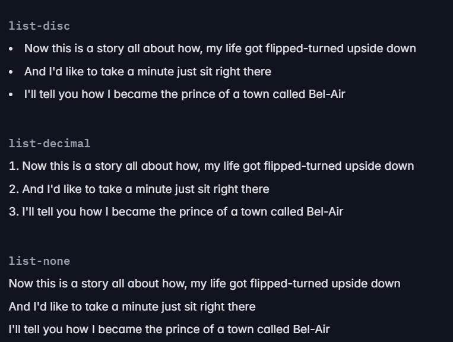
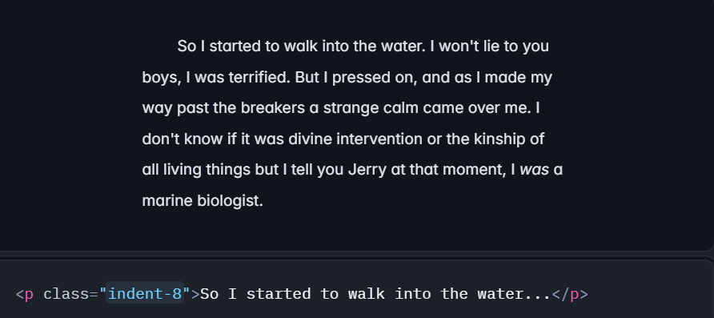

# Styling Guide for Tailwind Elements

This guide outlines a step-by-step process for effectively styling elements using Tailwind CSS.

---
 
## Setup using yarn


---

## Steps for Styling Each Element

1. **Add the HTML** – Structure your element with semantic HTML.
2. **Layout** – Define the positioning using Flexbox, Grid, or other layout utilities.
3. **Spacing** – Apply margins (`m-*`) and paddings (`p-*`) for proper spacing.
4. **Box Properties** – Style borders, backgrounds, and shadows for visual enhancements.
5. **Typography** – Adjust text size, weight, alignment, and spacing.
6. **Fun Elements** – Add transitions, animations, and interactive styles.
7. **Responsive Design** – Use responsive utilities to ensure adaptability across devices.

---

## Colors in Tailwind

- Below are the common Tailwind classes used for styling colors:

| Property         | Class Name                     |
|------------------|--------------------------------|
| **Text Color**   | `text-{color}-{shade}`         |
| **Background**   | `bg-{color}-{shade}`           |
| **Border**       | `border-{color}-{shade}`       |

- Creating my own colors

In the css file
```css
    @import "tailwindcss";

    @theme {
        --color-ColorName: #HexCode;
    }
```

In the TS file
```tsx
    const App = () => {
    return (
        <>
        <h1 className='bg-ColorName'>Hello World !</h1>
        </>
    )
    }

    export default App
```
---

## Directives

- Directives are custom Tailwind-specific at-rules you can use in your CSS that offer special functionality for Tailwind CSS projects.

| Directive        | Description |
|-----------------|-------------|
| `@import`       | Use to inline import CSS files. |
| `@theme`        | Defines project's custom design tokens like fonts, colors, and breakpoints. |
| `@source`       | Explicitly specifies source files that aren't detected automatically by Tailwind. |
| `@utility`      | Adds custom utilities that work with variants like `hover`, `focus`, and `lg`. |
| `@variant`      | Applies a Tailwind variant to styles in CSS. |
| `@custom-variant` | Adds a custom variant to the project. |
| `@apply`        | Inlines existing utility classes into custom CSS. |
| `@reference`    | Allows the use of `@apply` or `@variant` within `<style>` blocks or CSS modules by importing theme variables, custom utilities, and variants. |

For more details, check the [Tailwind CSS documentation](https://tailwindcss.com/docs/functions-and-directives#directives).

---

## Typography

### Default fonts :
1. font-sans
2. font-serif
3. font-mono

### How to use the fonts ?
```html
    <p class="font-sans ...">The quick brown fox ...</p>
    <p class="font-serif ...">The quick brown fox ...</p>
    <p class="font-mono ...">The quick brown fox ...</p>
```

### Custom font
```css
    @import url("https://fonts.googleapis.com/css2?family=Roboto&display=swap");
    @import "tailwindcss";
    @theme {
        --font-roboto: "Roboto", sans-serif; 
    }
```

```html
    <p class="font-roboto">This will use Roboto font family.</p>
```

### Font Size
- This is the order of the sizes from smaller to bigger.

  text-xs  
  text-sm  
  text-base  
  text-lg  
  text-xl  
  text-2xl  
  text-2xl  
  .  
  .  
  .  
  text-9xl  

- Custom text size    
  text-[sizeValue]  

  for ex:  
  ```html
      <p class="text-[14px] ...">
          <!-- ... -->
      </p>
  ``` 

### Line Height
- We can customize the line height of our paragraph element.  

    leading-none  
    text-sm/6  
    text-sm/7  
    text-sm/8  
  
### Customizing Font Size
```css
    @theme {
        --text-tiny: 0.625rem; 
    }
```
```html
    <div class="text-tiny">
        <!-- ... -->
    </div>
```

### Font Style
`italic`        
`underline`  

### Font Weight
- This is the order of the weight from thinner to bolder.  

    font-thin  
    font-extralight  
    font-light  
    font-normal  
    font-medium  
    font-semibold  
    font-bold  
    font-extrabold  
    font-black  

### Customizing Font Weight
```css
    @theme {
        --font-weight-extrablack: 1000; 
    }
```
```html
    <div class="font-extrablack">
        <!-- ... -->
    </div>
```

### Numeric Fonts
- This are classes to deal with numbers  
    normal-nums  
    ordinal  
    slashed-zero  

    lining-nums  
    oldstyle-nums  
    proportional-nums  
    tabular-nums  

    diagonal-fractions  
    stacked-fractions  

### Letter Spacing
- This is the order of the spacing from tighter to wider.    

    tracking-tighter    
    tracking-tight    
    tracking-normal  
    tracking-wide   
    tracking-wider  
    tracking-widest  

### Line Clamping
- Utilities for clamping text to a specific number of lines.  
    line-clamp-Number   
    line-clamp-none  

For ex;
```html
<article>
  <time>Mar 10, 2020</time>
  <h2>Boost your conversion rate</h2>
  <p class="line-clamp-3">
    Nulla dolor velit adipisicing duis excepteur esse in duis nostrud occaecat mollit incididunt deserunt sunt. Ut ut
    sunt laborum ex occaecat eu tempor labore enim adipisicing minim ad. Est in quis eu dolore occaecat excepteur fugiat
    dolore nisi aliqua fugiat enim ut cillum. Labore enim duis nostrud eu. Est ut eiusmod consequat irure quis deserunt
    ex. Enim laboris dolor magna pariatur. Dolor et ad sint voluptate sunt elit mollit officia ad enim sit consectetur
    enim.
  </p>
  <div>
    
    Lindsay Walton
  </div>
</article>
```

### List Style Image
- Utilities for controlling the marker images for list items.  
    list-image-[URL]

for ex ;
```html
<ul class="list-image-[url(/img/checkmark.png)]">
  <li>5 cups chopped Porcini mushrooms</li>
  <!-- ... -->
</ul>
```

### List Style Position
- Utilities for controlling the position of bullets and numbers in lists.  


### List Style Type
- Utilities for controlling the marker style of a list.  


### Text Allign
- Utilities for controlling the alignment of text.    
    text-left  
    text-center  
    text-right  
    text-justify  
    text-start  
    text-end  

### Text Color
- Utilities for controlling the text color of an element.  
    text-colorName-Degree  

- Utilities for controlling the opacity of the text color of an element.     
    text-colorName-Degree/opacityPercent

### Text Decoration Line
    underline  
    overline  
    line-through  
    no-underline   
    
### Text Decoration Line Color
- Utilities for controlling the color of text decorations.  
    decration-colorName-Degree

### Text Decoration Line Style
- Utilities for controlling the style of text decorations.  


### Text Decoration Line Thickness
- Utilities for controlling the thickness of text decorations.  


### Text Underline Offset
- Utilities for controlling the offset of a text underline.  


### Text Transform
- Utilities for controlling the capitalization of text.
    uppercase  
    lowercase  
    capitalize  
    normal-case  

### Text Overflow
- Utilities for controlling how the text of an element overflows.

| Utility        | Description |
|---------------|------------|
| `truncate`    | Prevents text from wrapping and truncates overflowing text with an ellipsis (…) if needed. |
| `text-ellipsis` | Truncates overflowing text with an ellipsis (…) if needed. |
| `text-clip`   | Truncates the text at the limit of the content area. |

### Text Wrap
- Utilities for controlling how text wraps within an element.  
    text-wrap  
    text-nowrap  
    text-balance  
    text-pretty  

### Text Indent
- Utilities for controlling the amount of empty space shown before text in a block.  
    indent-number  
for ex ;  


### Vertical Align
- Utilities for controlling the vertical alignment of an inline or table-cell box.
    align-baseline  
    align-middle  
    align-bottom  
    align-text-top  
    align-text-bottom 
    align-sub  
    align-super  

### White Space
- Utilities for controlling an element's white-space property.
    whitespace-normal  
    whitespace-nowrap  
    whitespace-pre  
    whitespace-pre-line  
    whitespace-pre-wrap  
    whitespace-break-spaces  

### Content
- Utilities for controlling the content of the before and after pseudo-elements.
    content-[Element]
    before:content-[Element]
    after:content-[Element]
---

## Layout
---

## Flexbox & Grid
---

## Spacing
---

## Sizing
---

## Backgrounds
---

## Borders
---

## Effects
---

## Filters
---

## Tables
---

## Transitions & Animation
---

## Transforms
---

## Interactivity
---

## SVG
---

## Accessibility
---