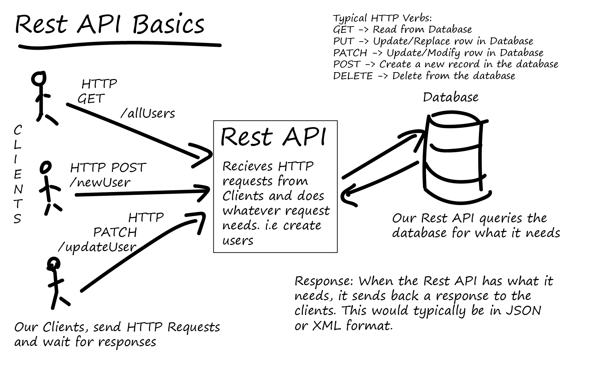
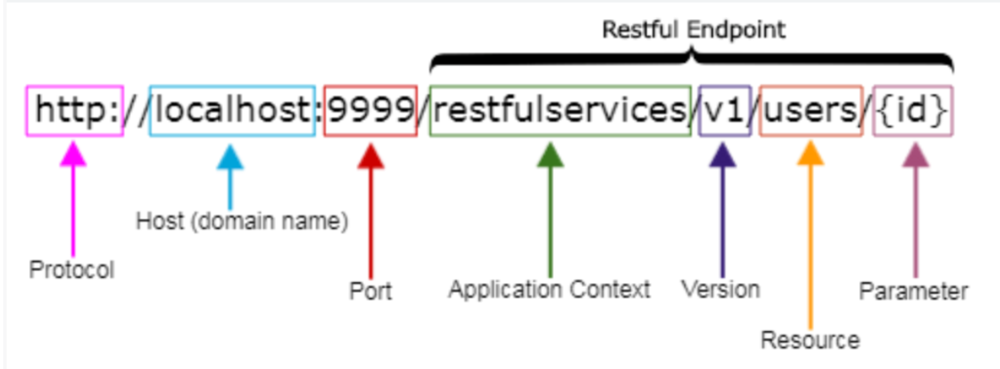

# 🌐 API Basics Summary

## 🔗 API (Application Programming Interface)
An **API** is a set of rules and protocols that allow different software applications to communicate with each other. APIs enable services like Amazon Web Services (AWS) to expose functionality to developers, making it easier to build complex applications without starting from scratch. [Learn more from AWS](https://aws.amazon.com/what-is/api/).

---

## 🌐 RESTful API
A **RESTful API** is an architectural style for designing networked applications. It uses standard HTTP methods (GET, POST, PUT, DELETE) and relies on stateless communication and structured access to resources—typically using URLs. REST APIs are widely used due to their simplicity and scalability.

---

## 🛠️ CRUD Operations
CRUD stands for:
- **Create** – Add new data (e.g., POST)
- **Read** – Retrieve existing data (e.g., GET)
- **Update** – Modify existing data (e.g., PUT or PATCH)
- **Delete** – Remove data (e.g., DELETE)

These four operations are the backbone of how applications manage data.  
[See full documentation](https://www.freecodecamp.org/news/crud-operations-explained/#:~:text=CRUD%20refers%20to%20the%20four,data%2C%20and%20delete%20the%20data.).

---

## 🔤 Path Parameters
**Path parameters** are dynamic parts of a URL used to identify specific resources. For example, in `/users/123`, `123` is a path parameter identifying a user by ID. These are commonly used to target individual records.

---

## ❓ Query Parameters
**Query parameters** are key-value pairs added to the end of a URL to filter or modify the response. For example:  
`/products?category=books&sort=price_asc`  
They allow for flexible requests like sorting, searching, or pagination.

---

# Postman API Software
- The same steps for the VS Code extension (ThunderClient).

## Collection 
- Save the requests of our application in a collection (folder) to perform the CRUD operations easily.
- Collections help organize requests, share them with teammates, and run them in sequence using Collection Runner or Monitor.

### Steps:
1. Open Postman.
2. Click on **Collections** tab in the left sidebar.
3. Click **+ New Collection**.
4. Name your collection and optionally add a description.
5. Click **Create**.
6. Inside the collection, click **Add Request** to start saving requests.
7. Organize requests into folders if needed for better structure (e.g., Auth, Users, Products).

## Environment
- Save the domain name in a variable for best practice and efficiency in renaming or updating it.
- Environments allow you to set different values for variables based on development, staging, or production contexts.

### Steps:
1. Click on the **Environments** icon (gear ⚙️) in the top right of Postman.
2. Click **+ Add** to create a new environment.
3. Name the environment (e.g., `Development`, `Production`).
4. In the **Variable** section, add a variable such as:
   - `Variable`: `base_url`
   - `Initial Value`: `https://api.example.com`
   - `Current Value`: `https://api.example.com`
5. Click **Save**.
6. Select the environment from the environment dropdown at the top right of the workspace.
7. Use the variable in requests like this: `{{base_url}}/users`.

--- 